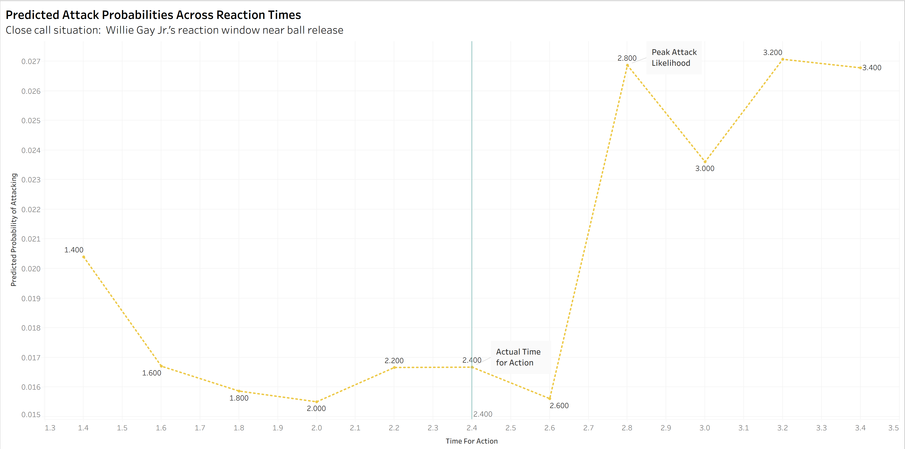

```{r, include=FALSE}
setwd("C:/Users/Cooper/Desktop/STAT479/big_data_bowl")
source("data_preperation.R")
source("modeling.R")
source("helper_functions.R")
source("player_track_graph.R")
```

## Introduction

The decision to attack or contain is constantly running through every defensive player's mind as they react to the ball being thrown. Often, choosing to attack can result in being burned and allowing a massive play, but when that gamble pays off it can lead to a game changing moment. Our project aims to create a multiclass classification system to determine when a defensive player should attack the ball or try to contain the receiver. 

## Methodology

The first step in building this model is to limit the data used for training. We focus on zone coverage plays, as zone coverage allows defenders greater freedom to make decisions. We also needed to determine which factors are most important in training this classification system. We found that the most critical variable is the reaction time of the defensive back. 

To quantify this, we implemented a change point detection system that calculates a metric we call the **change metric**, defined as: $$change metric = \sqrt{(angular\:velocity)^2 + (velocity)^2 + (acceleration)^2}$$ It is important to note that these values are calculated relative to where the ball will land, so we are measuring changes in angle and distance to the ball's landing spot. For each play, the system smooths the metric to reduce frame to frame noise. It then establishes a baseline using the player's initial moments and computes a threshold as the baseline plus three standard deviations. The first frame where the change metric exceeds this threshold is marked as the player's reaction point. If no reaction point is detected, the system defaults to the last observed distance and velocity values fort that player and play, avoiding the issues stemming from multiple change points. 

From there, we use the change point to determine the variable used in our model: **Time For Action**. This is calculated as the time from initial reaction to when the ball is ruled dead or the pass is completed. 

For example, below is a visualization of Daron Bland's record breaking fifth pick six in Week 12. Players are initially shown in red (offense) or blue (defense), but turn green when the initial reaction occurs.
```{r, echo=FALSE, warning=FALSE, message=FALSE}
library(ggplot2)
library(readr)
library(dplyr)
library(tidyverse)
library(gganimate)
library(sportyR) 


p = animate_play(12, 2023112301, 3879)
animate(p, fps = 10, width = 2000, height = 1250, units = "px", renderer = gifski_renderer())
```

Above, you can see that as soon as Bland begins moving toward the bottom of the graphic, our change point detection system marks this and calculates his **Time For Action**. One issue we encountered was early triggers of the detection system. Slight movements of players falling back into their zones can still cause the system to trigger a change point, which is not ideal. This can be improved by using previous movement data to create player profiles, detailing specific movement patterns to better detect true initial reactions.

Below is an overview of the best players in terms of **Time For Action**, along with the average EPA added on plays when they are on the field. This provides a sense of how **Time For Action** can impact the game. 

```{r, echo=FALSE, include=FALSE}
avg_epa = mean(data$expected_points_added)

top_time_for_action = data %>%
  group_by(nfl_id, player_name) %>%
  summarise(
    n_plays = dplyr::n(),
    avg_time_for_action = mean(time_for_action, na.rm = TRUE),
    avg_epa_allowed = mean(expected_points_added, na.rm = TRUE),
    .groups = "drop"
  ) %>%
  mutate(
    epa_diff_avg = avg_epa_allowed - mean(avg_epa_allowed)
  ) %>%
  dplyr::filter(
    n_plays > 150
  ) %>%
  arrange(desc(avg_time_for_action))

head(top_time_for_action, 10)
```


## Modeling

Our goal in modeling is to predict whether a player should attack the ball or play it safe and attempt to tackle the receiver. The model aims to predict the outcome of a given play from a given player’s perspective. For our purposes, there are three unique outcomes: completions, incompletions, and interceptions.

We determined that if the model predicts an interception, the player should attack the ball, as the model suggests they can make a play. Conversely, if the model predicts a completion or incompletion, the defensive player should aim to contain.

To tackle this, we chose to use an XGBoost model, as it is one of the stronger options for multiclass classification. When training, we chose not to weight our classes due to issues with over representing the probability of an interception, which led to poor performance. The tradeoff of this approach, however, is reduced predictive power for minority classes.

Our model considered the following variables:

- Player Name

- Player Position

- **Time For Action**

- Pass Length (how far down the field was the pass)

- Route of the Targeted Receiver

- Play Action 

- Distance to the Ball at Reaction Point

- Velocity to the Ball at Reaction Point

- Pass Location (where on the field was the ball thrown too)

Overall our results were encouraging but possibly slightly misleading. Below are some accuracy measurement by class and for the overall model.

```{r, echo=FALSE, include=FALSE}
per_class_accuracy = diag(cm) / rowSums(cm)

per_class_tbl = tibble::tibble(
  Metric = c(
    "Completion Accuracy",
    "Incompletion Accuracy",
    "Interception Accuracy"
  ),
  Accuracy = as.numeric(per_class_accuracy)
)


final_accuracy <- dplyr::bind_rows(
  accuracy,
  per_class_tbl
)

final_accuracy
```


While the high accuracy is a good start, our model struggles in other metrics such as F1 score. Our macro F1 score was 0.418, which is subpar. This is likely due to the significant class imbalance, as the model misclassified many plays in the minority class of interceptions.

In the future, we would address this issue in several ways. First, we would change the objective of the XGBoost model. Currently, we used logloss, which is acceptable, but we could use a statistic that better measures model fit, such as weighted cross-entropy or focal loss. We would also expand our sample sizes, giving the model more data to work with when classifying the minority class. Additionally, we would incorporate more tracking-based statistics, such as distance to the targeted receiver.

Despite these challenges, we wanted to determine how much **Time For Action** impacts classification results. We examined a few different situations, the first of which is when a player was close to making a play on the ball but wasn’t quite able to.

```{r, echo=FALSE, include=FALSE}
source("helper_functions.R")
mean_time_to_act = mean(test_data$time_for_action)

close_calls = test_data %>%
  dplyr::filter(pass_result == "C",
         time_for_action > mean_time_to_act, #The average react_time for all players in the testing data
         dist_to_ball_at_cp < 5) 

case_close = close_calls %>% 
  dplyr::slice(17)

plot_what_if_for_case(case_close, title_prefix = "Close Call - ")
```
{width=100% height=auto}
```{r, echo=FALSE, warning=FALSE, message=FALSE}
p2 = animate_play(case_close$week, case_close$game_id, case_close$play_id, nfl_id_arg = case_close$nfl_id)
animate(p2, fps = 10, width = 2000, height = 1250, units = "px", renderer = gifski_renderer())
```

Here we see Willie Gay Jr having a **Time for Action** of 2.4, but we see a sharp spike in attack probability a few tenths of a second later. You can see this is reasonable in the animation, as Gay Jr is close to where the ball is thrown and if he would have reacted quicker he might have been able to attack the ball. 


Another situation we were curious of is a player attacking the ball and succeeding, and how the probability of attacking changes as **Time For Action** changes. 

```{r, echo=FALSE, include=FALSE}
source("helper_functions.R")
interception = test_data %>%
  dplyr::filter(
    pass_result == "IN", 
    dist_to_ball_at_cp > 5) 


case_interception = interception %>% dplyr::slice(27) #4

plot_what_if_for_case(case_interception, title_prefix = "Interception - ")
```

{width=100% height=auto}

```{r, warning=FALSE, message=FALSE, echo=FALSE}
p3 = animate_play(case_interception$week, case_interception$game_id, case_interception$play_id, nfl_id_arg = case_interception$nfl_id)
animate(p3, fps = 10, width = 2000, height = 1250, units = "px", renderer = gifski_renderer())
```
Here we can see Kyzir White with a **Time For Action** of 2.3 seconds. Notice how if White would have reacted any differently, his likelihood of successfully attacking the ball falls. This is supported by the animation, as we see White cross the field to make the play, something that requires perfect timing. 


## Conclusions 

We aimed to determine whether defenders should attack the ball or contain the receiver on any given play. Coaches can use this classification to determine when to coach defensive players to attack and when to play the man. Because of having this information, defenders are able to make more informed decisions about attacking the ball, allowing for more game changing plays. Our work could also be used in a broadcast setting, highlighting defenders who are able to make a play on the ball on a given play.


## Future Improvements

While our classification system is a strong start, improvement are needed before it can reach its full potential. Firstly, improvements to the change point detection system would improve estimates of **Time For Action** leading to improved modeling. Our XGBoost model could also be improved by switching the objective from logloss to a statistic more useful in multiclass classification such as weighted cross-entropy or focal loss. An improved sample size would also help in increasing our macro F1 scores by decreasing the number of false negatives and positives.  


[Here is the Github Link to our project](https://github.com/CooperWisener/Attack-or-Contain-Defensive-Decision-Making-in-Pass-Coverage)

